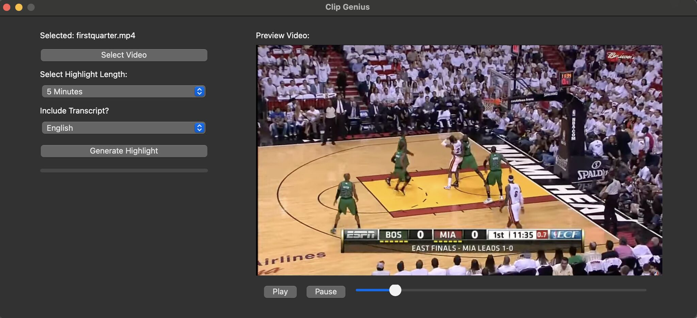
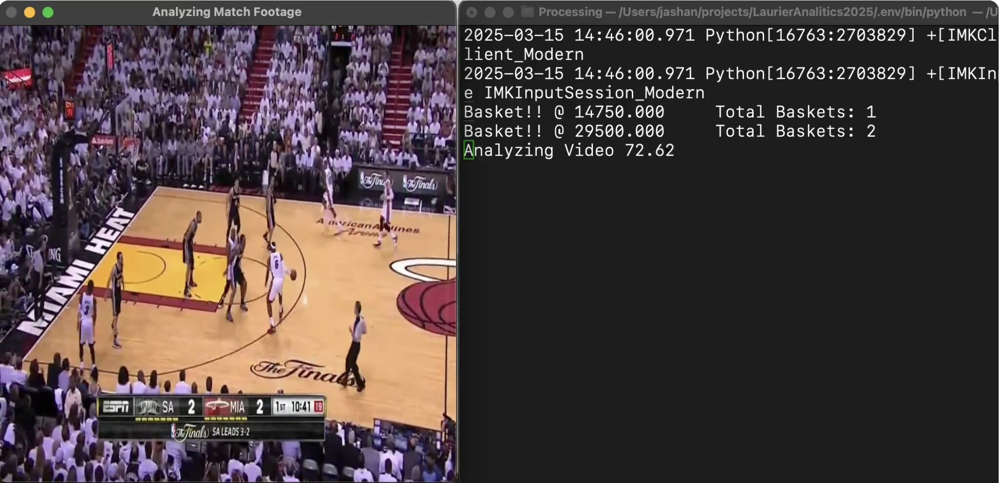

# Scoreboard Analyzer AI

An AI-powered sports video analyzer built during the **Google Datathon @ Laurier Analytics 2025**, focused on transforming long, under-promoted sports footage into short, high-impact highlight reels automatically.

---

## Problem Addressed

Lesser-known sports leagues and women’s sports often lack visibility due to time-consuming editing processes and limited coverage. Gen Z, in particular, demands short, engaging, and shareable content—something current workflows struggle to deliver.

---

## Our Solution

**Scoreboard Analyzer AI** automates the entire video-editing pipeline for sports highlights by combining:

- Computer Vision (OpenCV)
- Optical Character Recognition (PyTesseract)
- Natural Language Processing (NVIDIA NeMo)
- Parallel video processing using FFmpeg

Together, they detect scoreboard events, analyze commentary for excitement, and auto-generate highlight clips within seconds.

---

## Key Features

- **Real-Time Score Tracking**  
  Extracts scoreboard values from video frames using edge detection and OCR.

- **Commentary Analysis with NLP**  
  Uses NeMo to identify and rank the most exciting moments based on commentary sentiment.

- **Highlight Clip Generation**  
  Automatically generates clips around detected score events.

- **Efficient Processing**  
  Multi-threaded processing saves up to 14 hours per project by automating segment-based editing.

### Feature Previews


*Scoreboard region successfully identified and extracted from raw footage.*


*Highlight moment timestamped and isolated for auto-clip generation.*
---

## Tech Stack

- `OpenCV` – Video frame processing  
- `PyTesseract` – OCR for extracting numeric scoreboard data  
- `FFmpeg` – Video segmentation and clip generation  
- `NeMo (NVIDIA)` – NLP pipeline for analyzing audio commentary  
- `FAISS` – Similarity search in audio/text embeddings  
- `Python threading` – Concurrent video processing for speed

---

## Usage

```bash
python main.py <video_path> --function <function_name> --debug --output <output_dir>
```


## Contributors

- **JD** – [jashandeep.co.uk](https://jashandeep.co.uk)
- **Robert Pevec** – [robertpevec.com](https://robertpevec.com)
- **Sawaab Anas** – [GitHub](https://github.com/SawaabA)
- **Suhana Khullar** – [Instagram](https://instagram.com)

---
> **📄 Full Documentation:**  
> My amazing teammate and friend created fantastic documentation for this project.  
> 👉 [Visit the docs here](https://jashandeep.co.uk/pages/LaurierAnalytics2025#91oz.-9s74o8ib7)
---

## Acknowledgments

The Laurier Analytics Hackathon was an incredible opportunity to collaborate, innovate, and push the boundaries of what we could achieve in a short timeframe. Over the course of the event, our team worked tirelessly to design and develop this solution, overcoming technical challenges and learning new skills along the way. The experience was both rewarding and inspiring.

We would like to extend our gratitude to the Laurier Analytics team and Google Waterloo for organizing this event and providing a platform for student innovation.

Special thanks to our mentor, **Shivam Garg**, for offering critical guidance and feedback throughout the project.

---

## Next Iteration Plan

**Upgrade OCR Engine**  
Integrate more advanced OCR engines such as Google Vision API or AWS Textract for higher accuracy.

**Improve Accuracy**  
Fine-tune scoreboard detection and scoring logic to handle a wider variety of video types and layouts.

**Cloud Integration**  
Enable scalable video processing via cloud services like Google Cloud Platform or AWS.

**Robust Storage Layer**  
Build a persistent backend for storing highlight clips, metadata, and analysis outputs.


